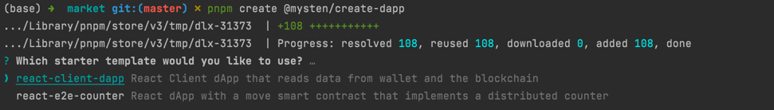

# install

## install node

## install pnmp

### use 

> https://sui-typescript-docs.vercel.app/dapp-kit

```shell
pnpm create @mysten/create-dapp
```


chose 
`react-e2e-counter`

chose name 
`market`


add  kiosk sdk
```shell
pnpm add @mysten/kiosk
```